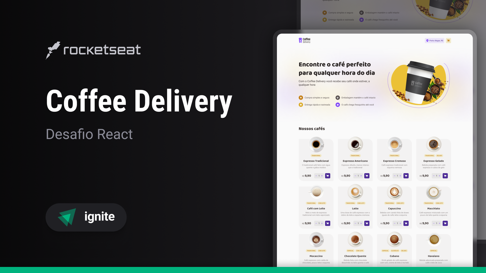

# Desafio React 2 - Coffe Delivery

<p align="center">
  
</p>

---

# 📖 Sumário

  - [👤 Autoria](#-autoria)
    - [📧 Contatos](#-contatos)
  - [📝 Descrição do Projeto](#-descrição-do-projeto)
  - [🛠 Tecnologias Utilizadas](#-tecnologias-utilizadas)
  - [🚀 Como Rodar o Projeto Localmente](#-como-rodar-o-projeto-localmente)

---

## 👤 Autoria

Desenvolvido por: **Nicolas Loffi Kaminski**

[](https://github.com/NicolasLK)
[](https://www.linkedin.com/in/nicolas-kaminski-b479b8160/)
[](https://www.instagram.com/nicolasloffikaminski/)

### 📧 Contatos

**Email Principal:**

[](mailto:nicolas.loffi@gmail.com)

**Email Secundario:**

[](mailto:nicolas.kaminski.2001@gmail.com)

---

## 📝 Descrição do Projeto

  Esse desafio tem como objetivo desenvolver uma aplicação front-end que realiza o gerenciamento de compra de uma cafeteria fictícia, as funcionalidades são as seguintes:
  - Listagem de produtos(Para compra e selecionados);
  - Adição de quantidade específica no carrinho;
  - Adição ou remoção da quantidade de produtos dentro do carrinho;
  - Formulário de endereço para o usuário preencher;
  - Exibição da quantidade de tipos de produtos no Header;
  - Exibir o valor total da compra no carrinho(ValProd x QtdProd + Frete);

<br>

  Com essas funcionalidades em mente, foram aplicados os seguintes conceitos:
  - Estados;
  - ContextAPI;
  - LocalStorage;
  - Imutabilidade do estado;
  - Listas e chaves no ReactJS;
  - Propriedades;
  - Componentização;
  
<br>

  **Bônus**: Utilizei uma [API de CEP](https://viacep.com.br/) para preenchimento automático do formulário de endereço, ou seja, o usuário preenche o campo de CEP e as outras informações(Exceto número) são preenchidas automaticamente pela API.

  [Notion do projeto](https://efficient-sloth-d85.notion.site/Desafio-02-Coffee-Delivery-30e42a21fdb44b09a85244fc2c3dbdf9)

---

## 🛠 Tecnologias Utilizadas

- **Trio da Web**
  -   

-  [](https://vitejs.dev/) [](https://react-hook-form.com/) [](https://zod.dev/) [](https://reactrouter.com/) [](https://immerjs.github.io/immer/) [](https://www.typescriptlang.org/) [](https://tailwindcss.com/) [](https://axios-http.com/)
- Outras ferramentas ou bibliotecas...

---

## 🚀 Como Rodar o Projeto Localmente

Siga os passos abaixo para rodar o projeto localmente:

1. Clone o repositório:
  ```bash
   git clone https://github.com/NicolasLK/2_Desafio_Coffe_Delivery.git
  ```
   ou
  ```bash
   git clone git@github.com:NicolasLK/2_Desafio_Coffe_Delivery.git
  ```
2. Acesse o diretório do projeto:
  ```bash
   cd 2_Desafio_Coffe_Delivery
  ```
3. Instale as dependências:
  ```bash
   npm install
  ```
4. Rode o projeto:
  ```bash
   npm run dev
  ```
  Agora o projeto estará rodando localmente em ``http://localhost:3000``.